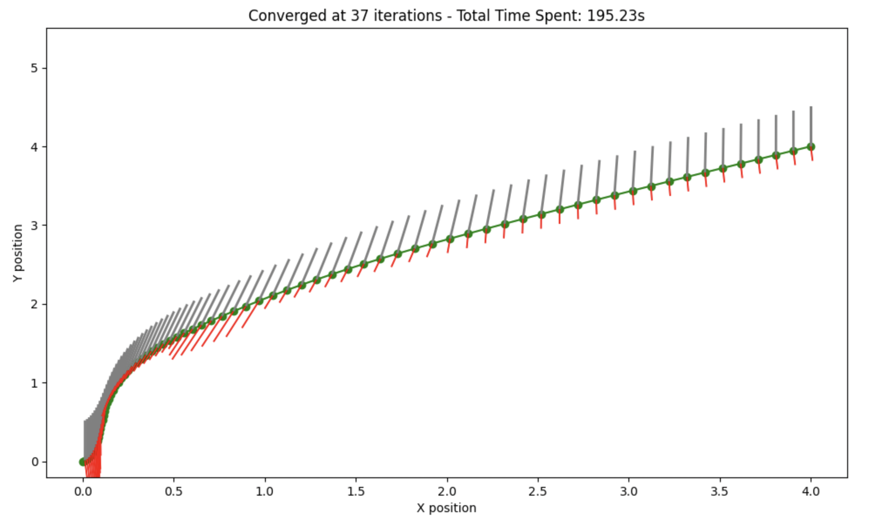

# Fixed Time 3DOF Rocket Landing with Sequential Convex Programming and SciPy Optimization

This repository contains code and documentation for solving a fixed final time 3DOF rocket landing problem, comparing Sequential Convex Programming (SCP) with general nonlinear optimization using SciPy.

## Overview

In this project, we address the problem of landing a rocket with three degrees of freedom (3DOF) by employing Sequential Convex Programming (SCP) and compare it with a general nonlinear solver. We leverage SciPy's optimization capabilities to find the optimal control inputs that ensure a safe landing.

## Documentation

You can find the detailed documentation in the PDF below:

[Project Poster](./Poster.pdf)

## Code Structure

- `rocket_landing_scp.ipynb`: Script for implementing SCP for the 3DOF rocket landing problem.
- `rocket_landing_nonlinear.ipynb`: Script for implementing a general nonlinear solver for comparison.
- `README.md`: This file.
- `Successive Convex Optimization.pdf`: Detailed documentation of the methods and results.

## Results

The optimization results, including plots of the rocket's trajectory, thrust vs.time  gimbal angles vs. time, and speed vs. time, will be generated and displayed for both approaches.

### Trajectory Plot from Cequential Convex Programming Algorithm

### Thrust vs Time Plot from Cequential Convex Programming Algorithm

### Gimbal Angle vs.Time Plot from Cequential Convex Programming Algorithm

### Speed vs. Time Plot from Cequential Convex Programming Algorithm

### Trajectory Plot from Cequential Convex Programming Algorithm

### Thrust vs Time Plot from Cequential Convex Programming Algorithm

### Gimbal Angle vs.Time Plot from Cequential Convex Programming Algorithm

### Speed vs. Time Plot from Cequential Convex Programming Algorithm

## Contributing

Feel free to fork this repository, make changes, and submit pull requests. Contributions are welcome!
